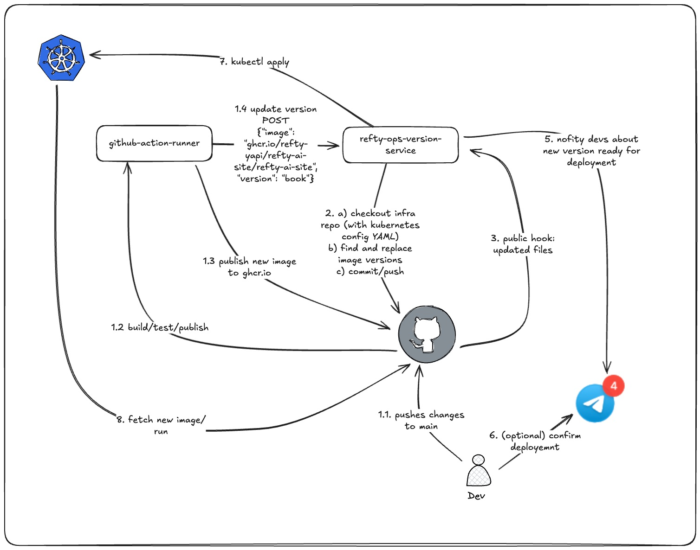

# 🛠️ refty-node-versions-service

A DevOps microservice that automates updating container image versions across Kubernetes YAML files in a GitHub repository.

Built with **FastAPI**, **GitPython**, and **PyYAML**, this service is designed to power GitOps workflows and keep your infrastructure up-to-date — one Docker tag at a time 🚀

---

## 🧭 Architecture



---

## ✨ Features

- Accepts RESTful POST requests with image + version data
- Clones your forked infrastructure repo
- Finds & updates all matching container image tags in `.yaml`/`.yml` files
- Creates a Git commit and pushes changes
- Authenticates via GitHub Personal Access Token
- Logs every step (and fails loudly when needed)

---

## 📦 Tech Stack

- [FastAPI](https://fastapi.tiangolo.com/) – for blazing fast APIs
- [GitPython](https://gitpython.readthedocs.io/) – to interact with Git repos
- [PyYAML](https://pyyaml.org/) – to parse and write YAML files
- [python-dotenv](https://pypi.org/project/python-dotenv/) – to manage environment configs

---

## 🚀 Getting Started

### 1. Clone this repo

```bash
git clone https://github.com/javy99/refty-node-versions-service.git
cd refty-node-versions-service
```

### 2. Create and activate virtual environment
```bash
python -m venv venv
source venv/bin/activate
```

### 3. Install dependencies
```bash
pip install -r requirements.txt
```

---

## ⚙️ Configuration

Create a .env file in the root of your project with the following variables:

```bash
GITHUB_TOKEN=ghp_XXXXXXXXXXXXXXXXXXXXX
GITHUB_USERNAME=your-github-username
REPO_NAME=refty-infra-test
```

    FORKED_REPO_URL is automatically built using the values above.

Make sure you've already forked the target repo:
👉 https://github.com/alun/refty-infra-test

---

## 🧪 Running the Service

Start the FastAPI server with Uvicorn:

```bash
uvicorn app.main:app --reload
```

API will be live at: http://127.0.0.1:8000

---

## 🔁 Usage

Send a POST request to:
```pgsql
POST /update-image-version
```

### ✅ JSON Payload format:
```json
{
  "image": "ghcr.io/refty-yapi/refty-node/refty-node",
  "version": "05-06-42a252"
}
```

### 🧪 Example curl:
```bash
curl -X POST http://127.0.0.1:8000/update-image-version \
  -H "Content-Type: application/json" \
  -d '{
    "image": "ghcr.io/refty-yapi/refty-node/refty-node",
    "version": "05-06-42a252"
}'
```

---

## 📁 Project Structure
```graphql
refty-node-versions-service/
├── app/
│   ├── main.py              # FastAPI entry point
│   ├── config.py            # Loads environment variables
│   ├── github_utils.py      # Git operations
│   ├── yaml_updater.py      # YAML file scanning + updating
├── requirements.txt
├── .env                     # Your GitHub credentials (not committed)
├── README.md
```

---

## 🐳 Docker Deployment

You can containerize and run this service using Docker.

### 📦 Build the Docker image

```bash
docker build -t refty-node-service .
```

### ▶️ Run the container

```bash
docker run -p 8000:80 --env-file .env refty-node-service
```

- This exposes the API on localhost:8000

---